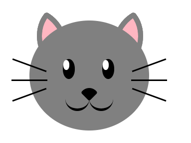

Creating drawings with just html and css. I recently saw a lesson where freecodecamp did this with a penguin and I thought it was an interesting exercise. 

To preview the cat as interpreted html, check out https://htmlpreview.github.io/?https://github.com/bernalev/html-animal/blob/master/cat.html

For a recent commit (July 15, 2020), the cat looks like so: 
 

This was done simply by stylizing div's.
